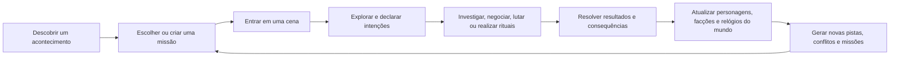

# Motor Narrativo Operacional
Codinome: Caravans
> Sistema digital para RPG investigativo, sobrenatural e orientado por consequências, construído ao redor de cenas interativas, intenções declarativas e progressão aberta por Caminhos.

> **Status:** projeto em concepção e prototipação. Nomes, quantidades, regras de progressão e elementos de ambientação ainda podem mudar durante os testes.

---

## Visão do projeto

O **Motor Narrativo Operacional** busca criar uma experiência de RPG em que o mundo não espera passivamente pelos jogadores.

Missões, personagens, organizações, ameaças e regiões continuam evoluindo conforme o tempo avança e de acordo com as decisões tomadas pelo grupo. Uma missão pode terminar em sucesso, fracasso ou vitória parcial, e cada resultado modifica o estado persistente do universo.

O sistema está sendo desenvolvido inicialmente para partidas conduzidas por **cenas visuais em 2D**, com imagens, mapas, tokens e pontos de interesse interativos. No futuro, a mesma base de regras e dados poderá alimentar uma **mesa tática em 3D**, sem exigir que o funcionamento central do jogo seja reconstruído.

A proposta não é criar apenas um tabuleiro virtual, mas um motor capaz de representar:

- investigação;
- exploração;
- conflitos táticos;
- interações sociais;
- furtividade;
- rituais;
- administração de recursos;
- evolução de organizações;
- consequências narrativas persistentes;
- progressão sobrenatural aberta.

---

## Pilares do projeto

### 1. Um mundo que continua se movendo

O universo possui seus próprios acontecimentos, planos e conflitos.

Organizações, entidades e personagens não jogadores podem avançar seus objetivos mesmo quando não estão sendo observados. Os jogadores interferem nesse mundo, mas não são o centro de todos os acontecimentos.

Uma pista ignorada pode desaparecer. Um personagem pode abandonar um local antes da chegada do grupo. Uma organização pode concluir parte de um ritual, capturar alguém, preparar uma armadilha ou assumir o controle de uma região.

### 2. Consequências acima de resultados binários

As missões não devem existir apenas como “vitória” ou “derrota”.

Falhar ao interromper um ritual, por exemplo, pode gerar diferentes consequências:

- o ritual é concluído corretamente;
- o ritual falha e transforma os participantes;
- a entidade é invocada de forma incompleta;
- uma organização rival se apropria do resultado;
- a região passa a sofrer uma nova influência;
- uma missão posterior surge a partir do fracasso.

O resultado de uma missão modifica o mundo e cria novas possibilidades de jogo.

### 3. Cenas como unidade principal da experiência

A campanha é organizada em:

```text
Campanha
└── Sessões
    └── Cenas
        ├── Objetos
        ├── Personagens
        ├── Pontos de interesse
        ├── Pistas
        ├── Intenções
        ├── Eventos
        └── Transições
```

Cada cena representa um contexto jogável com regras, objetos, personagens e possibilidades próprias.

Uma cena pode ser:

- livre;
- investigativa;
- social;
- furtiva;
- de perseguição;
- de interlúdio;
- de combate;
- ritualística;
- tática.

Esses tipos não precisam funcionar como categorias rígidas. Uma cena pode mudar de comportamento durante a partida ou combinar diferentes estruturas.

### 4. Progressão sem classes rígidas

O projeto não utiliza o modelo clássico em que o personagem escolhe uma classe e permanece preso a uma função definida.

A progressão acontece principalmente através de **Caminhos**, descobertas, rituais, vínculos, características sobrenaturais, experiências e consequências pessoais.

O Caminho define uma relação temática com o sobrenatural, mas não determina sozinho como o personagem deve jogar.

### 5. O visual como camada, não como regra

A representação atual utiliza imagens e mapas em 2D, mas as regras do jogo não devem depender exclusivamente dessa apresentação.

Objetos, personagens, posições, pistas, intenções e eventos devem existir como dados independentes da interface visual.

Com isso, uma mesma cena poderá ser apresentada futuramente como:

- imagem estática com pontos de interesse;
- mapa 2D com tokens;
- mapa com grid;
- mapa livre sem grid;
- mesa isométrica;
- ambiente tático em 3D;
- interface adaptada para celular;
- visão da mesa em uma televisão ou monitor.

---

## Ciclo principal de jogo



O ciclo deve permitir que os jogadores sigam pistas planejadas, ignorem caminhos sugeridos ou criem novas sequências de acontecimentos a partir de suas próprias decisões.

---

## Sistema de cenas

### Cena visual

Uma cena visual utiliza uma imagem do ambiente sem exigir movimentação por grid.

Ela pode conter pontos de interesse como:

- uma marca de sangue;
- uma escrivaninha;
- um corpo;
- uma porta trancada;
- um símbolo ritualístico;
- um personagem;
- uma passagem parcialmente escondida.

Ao selecionar um ponto de interesse, o jogador acessa as interações disponíveis para aquele objeto.

### Cena de mapa

Uma cena de mapa utiliza tokens sobre uma imagem ou tabuleiro.

Ela pode funcionar:

- com grid;
- sem grid;
- com movimentação livre;
- com áreas ou zonas;
- com distâncias aproximadas;
- com regras táticas completas.

### Objetos e pontos de interesse

Um ponto de interesse representa uma área clicável, mas está associado a um **Objeto de Cena**.

O mesmo objeto pode aparecer em diferentes representações. Uma escrivaninha, por exemplo, pode existir no mapa da sala e também em uma cena visual aproximada.

Cada objeto pode possuir:

- descrição básica;
- estado atual;
- ações disponíveis;
- testes possíveis;
- dificuldades ocultas;
- pistas vinculadas;
- condições de descoberta;
- eventos disparados;
- transições para outras cenas.

### Pistas e testes

As pistas são vinculadas ao teste utilizado para procurá-las.

Exemplo:

```text
Objeto: Marca de sangue

Investigação
- DT 10: o sangue é humano.
- DT 15: há dois padrões diferentes de respingo.
- DT 20: parte da marca foi produzida depois da morte.

Ocultismo
- DT 15: o sangue foi utilizado como componente de um ritual.
```

Um resultado elevado em Investigação pode liberar todas as pistas de Investigação abaixo daquele valor, mas não deve liberar automaticamente uma pista de Ocultismo.

As pistas podem ser registradas:

- individualmente por jogador;
- para todo o grupo;
- como informação conhecida por um personagem específico;
- como informação ainda não compartilhada;
- como descoberta pendente de interpretação.

### Transições entre cenas

Cenas podem ser conectadas por rotas diretas ou condicionais.

Exemplos:

- entrar por uma porta;
- seguir um personagem;
- descobrir uma passagem;
- concluir um ritual;
- ativar uma armadilha;
- possuir determinada pista;
- avançar o relógio de uma organização;
- alterar o estado de um objeto.

Uma transição pode manter o mapa atual, trocar apenas a imagem visual ou levar o grupo para um novo local.

---

## Intenções declarativas

As ações do jogador são representadas como **intenções**.

Em vez de depender de uma lista universal de comandos, o sistema interpreta o contexto selecionado.

Exemplos:

- clicar em um espaço vazio pode oferecer movimentação;
- clicar em um inimigo pode oferecer ataque, intimidação ou análise;
- clicar em um aliado pode oferecer ajuda, proteção ou uso de habilidade;
- clicar em um objeto pode oferecer investigação, manipulação ou ritual;
- clicar no próprio personagem pode abrir ações pessoais, itens e recursos.

Uma intenção pode conter:

- autor;
- alvo;
- objetivo;
- perícia ou habilidade utilizada;
- recurso consumido;
- posição;
- risco;
- reação possível;
- resultado;
- consequências geradas.

Em partidas conduzidas por um mestre, determinadas intenções podem exigir aprovação, ajuste ou resolução manual. Essas decisões devem permanecer registradas no histórico da cena.

---

## Tempo e evolução do mundo

O projeto trabalha com diferentes escalas de tempo.

### Tempo global

Representa o avanço geral da campanha.

O tempo pode avançar por:

- conclusão de missão;
- fracasso;
- viagem;
- descanso;
- uso de recursos;
- eventos programados;
- passagem de tempo real, quando apropriado.

### Relógios de ameaça e organização

Planos importantes podem ser representados por relógios divididos em etapas.

Um plano pode possuir, por exemplo, de três a cinco segmentos:

```text
0/4 — os cultistas ainda procuram os componentes.
1/4 — o local do ritual foi preparado.
2/4 — vítimas foram capturadas.
3/4 — a entidade começa a influenciar a região.
4/4 — o ritual é concluído.
```

Entrar na missão quando o relógio está em `0/4` deve produzir uma situação diferente de entrar quando ele está em `3/4`.

### Influência ambiental

Entidades e organizações podem modificar o ambiente.

Essa influência pode aparecer como:

- clima;
- iluminação;
- sonhos;
- comportamento animal;
- corrupção;
- fenômenos sobrenaturais;
- alterações na população;
- mudanças físicas no cenário.

Os jogadores também podem modificar uma região por meio de rituais, purificações, alianças ou domínio territorial. Entretanto, manifestar poder pode funcionar como um farol e alertar forças inimigas.

### Tempo de cena

Nem toda cena precisa ser rigidamente dividida em turnos.

Cenas livres podem ocorrer de forma fluida. Quando o conflito, a urgência ou a precisão exigirem, o sistema pode ativar:

- rodadas;
- iniciativa;
- janelas de ação;
- reações;
- eventos de fim de rodada;
- limites de tempo.

Essa estrutura permite que investigação e interpretação permaneçam naturais sem abandonar o suporte a combates e perseguições táticas.

---

## Personagens

O personagem não é definido por uma única classe.

Sua identidade mecânica pode ser formada por diferentes camadas:

- atributos;
- perícias;
- experiências;
- equipamentos;
- condições;
- vínculos;
- organização;
- Caminho;
- poderes escolhidos;
- rituais conhecidos;
- pactos;
- marcas;
- corrupção;
- consequências permanentes.

A história inicial também não precisa funcionar como uma origem rígida. Ela pode fornecer contexto narrativo, relações e problemas sem determinar toda a progressão futura.

---

## Progressão por Caminhos

### O que é um Caminho?

Um **Caminho** é uma trilha de transformação relacionada a um princípio, entidade, mistério, força ou interpretação do sobrenatural.

Ele não funciona como uma profissão tradicional. Seguir um Caminho significa compreender e incorporar gradualmente uma forma específica de poder.

Um Caminho pode influenciar:

- percepção;
- corpo;
- mente;
- presença;
- rituais;
- relacionamento com entidades;
- interação com o ambiente;
- capacidades narrativas;
- habilidades de combate;
- riscos de corrupção.

### Patamares de progressão

Cada Caminho pode ser dividido em patamares, graus ou marcos.

A progressão não ocorre apenas pelo acúmulo de experiência. Para avançar, o personagem pode precisar:

- descobrir um conhecimento;
- encontrar componentes;
- realizar um ritual;
- cumprir uma condição narrativa;
- receber ensinamentos;
- enfrentar um portador mais avançado;
- recuperar uma característica sobrenatural;
- aceitar um pacto;
- sobreviver a uma transformação;
- demonstrar domínio sobre o estágio atual.

O avanço deve ser uma parte da história, e não apenas uma escolha realizada em um menu.

### Caminhos não definem estilos fixos

As antigas categorias **Combatente**, **Furtivo** e **Erudito** não serão tratadas como divisões obrigatórias do sistema.

Elas podem permanecer como descrições informais, filtros ou referências de comportamento, mas não como estruturas que limitem o personagem.

As formas de jogar devem emergir da combinação de escolhas como:

- confronto;
- proteção;
- mobilidade;
- furtividade;
- investigação;
- manipulação;
- interação social;
- conhecimento;
- ritualismo;
- controle;
- criação;
- suporte;
- sobrevivência;
- exploração.

Dois personagens do mesmo Caminho podem desenvolver funções completamente diferentes.

Um personagem ligado à natureza, por exemplo, pode se tornar:

- um combatente transformado;
- um curandeiro;
- um controlador de terreno;
- um investigador de fenômenos naturais;
- um criador de componentes;
- um ritualista;
- um infiltrador capaz de alterar o próprio corpo.

### Escolhas internas

O avanço dentro de um Caminho não precisa entregar automaticamente todas as habilidades previstas.

Cada patamar pode oferecer escolhas, especializações ou manifestações diferentes. Dessa forma, o Caminho cria uma identidade temática sem produzir personagens idênticos.

### Vias convencionais e não convencionais

A progressão pode ocorrer por métodos reconhecidos pelas organizações ou por rotas proibidas.

#### Progressão convencional

Pode envolver:

- fórmulas conhecidas;
- componentes mapeados;
- rituais controlados;
- mentores;
- instituições;
- características compatíveis;
- provas de domínio.

#### Progressão não convencional

Pode envolver:

- pactos com entidades exteriores;
- características incompatíveis;
- rituais incompletos;
- artefatos desconhecidos;
- caminhos artificiais;
- corrupção;
- fusão de princípios;
- conhecimento proibido.

Rotas não convencionais podem conceder grande poder, mas aumentam o risco de instabilidade, perda de controle e transformação.

### Combinação de Caminhos

A combinação de Caminhos deve existir como uma possibilidade rara e perigosa, não como uma otimização comum.

Carregar princípios incompatíveis pode alterar recursos como:

- estabilidade;
- loucura;
- discernimento;
- corrupção;
- humanidade;
- controle;
- vulnerabilidade mental.

A intenção é permitir construções avançadas sem remover o custo narrativo e mecânico dessa decisão.

---

## Abordagens de jogo

O projeto não define que todo grupo precisa possuir um combatente, um furtivo e um erudito.

As abordagens abaixo representam possibilidades, não classes:

| Abordagem | Exemplos |
|---|---|
| Confronto | atacar, perseguir, proteger e conter ameaças |
| Furtividade | infiltrar, ocultar, sabotar e enganar |
| Investigação | observar, comparar pistas e reconstruir acontecimentos |
| Social | persuadir, manipular, intimidar e negociar |
| Ritualística | preparar rituais, selar, invocar e purificar |
| Controle | modificar zonas, condições, clima ou comportamento |
| Suporte | curar, fortalecer, proteger e compartilhar recursos |
| Mobilidade | atravessar obstáculos, reposicionar e criar rotas |
| Criação | produzir itens, ferramentas, compostos e estruturas |
| Sobrevivência | resistir, rastrear, administrar recursos e adaptar-se |

Um personagem pode combinar várias abordagens e alterá-las conforme progride.

---

## Organizações e conhecimento oculto

O conhecimento sobrenatural não está distribuído igualmente.

Igrejas, organizações, famílias, universidades, seitas e círculos independentes controlam diferentes partes dos Caminhos.

As organizações podem ser classificadas de acordo com sua relação com a sociedade:

- reconhecidas ou ortodoxas;
- clandestinas;
- heréticas;
- independentes;
- familiares;
- acadêmicas;
- criminosas;
- exteriores.

Cada organização pode possuir:

- Caminhos conhecidos;
- fórmulas e rituais;
- territórios;
- recursos;
- células;
- aliados;
- inimigos;
- doutrinas;
- segredos;
- relógios de influência;
- objetivos próprios.

A lista definitiva de organizações, entidades e Caminhos ainda será revisada para fortalecer a identidade original do universo.

---

## Loucura, discernimento e corrupção

O contato com o sobrenatural não concede apenas benefícios.

Quanto mais o personagem compreende forças incompreensíveis, mais ele se torna capaz de percebê-las — e mais perceptível se torna para elas.

O sistema poderá trabalhar com conceitos como:

- **Estabilidade:** capacidade de manter controle e identidade;
- **Loucura:** aproximação de comportamentos, impulsos ou transformações destrutivas;
- **Discernimento:** capacidade de perceber e compreender fenômenos ocultos;
- **Corrupção:** alteração produzida por uma força específica;
- **Humanidade:** vínculo com valores, memórias e relações pessoais.

Esses recursos ainda estão em definição e não precisam funcionar como uma única barra numérica.

---

## Ascensão e final de campanha

Em estágios avançados, personagens podem buscar formas de ascensão.

Esse processo pode exigir:

- artefatos únicos;
- princípios ou características;
- domínio completo de um Caminho;
- rituais de grande escala;
- controle territorial;
- sacrifícios;
- alianças;
- confrontos contra outras entidades;
- aceitação das consequências da transformação.

Uma das possibilidades de encerramento de campanha é permitir que o personagem imponha uma **Lei** ao próximo mundo antes de abandonar sua forma atual.

Essa Lei pode modificar uma campanha futura, por exemplo:

- uma regra fundamental da magia;
- o comportamento de uma entidade;
- a existência de determinada raça ou fenômeno;
- o custo de um tipo de poder;
- a relação entre sonho e realidade;
- a forma como os mortos permanecem no mundo.

Esse conceito transforma o encerramento de uma campanha em parte da criação da próxima.

---

## Simulação narrativa e geração de missões

O sistema deve ser capaz de criar ou adaptar missões a partir do estado do mundo.

Uma missão pode nascer de:

- avanço de um relógio;
- consequência de uma missão anterior;
- pedido de uma organização;
- descoberta de uma pista;
- desaparecimento de um personagem;
- mudança ambiental;
- conflito territorial;
- ritual detectado;
- decisão dos jogadores;
- evento dinâmico.

O histórico das escolhas do grupo também pode ajudar o sistema a identificar quais tipos de situações são mais interessantes para aquela mesa.

Esse aprendizado não deve remover a imprevisibilidade ou transformar toda missão em uma repetição do conteúdo preferido. Ele deve funcionar como apoio para variedade, ritmo e personalização.

---

## Arquitetura conceitual

A lógica do projeto deve ser independente da forma de apresentação.

```text
Domínio do jogo
├── Campanhas
├── Sessões
├── Cenas
├── Personagens
├── Objetos
├── Intenções
├── Pistas
├── Eventos
├── Caminhos
├── Organizações
└── Estado do mundo
        │
        ├── Interface do mestre
        ├── Interface do jogador
        ├── Cena visual 2D
        ├── Mapa com tokens
        ├── Mesa compartilhada
        └── Ambiente 3D futuro
```

Essa separação permite evoluir o visual sem reescrever as regras e a persistência do sistema.

---

## Escopo atual do MVP

O primeiro MVP deve validar o ciclo de cenas e investigação antes de tentar simular todo o universo.

### Incluído no MVP

- autenticação básica;
- acesso de jogadores à campanha;
- criação de campanhas, sessões e cenas;
- cena 2D baseada em imagem;
- mapa com tokens arrastáveis;
- cenas com ou sem grid;
- objetos de cena;
- pontos de interesse;
- testes vinculados a objetos;
- dificuldades ocultas;
- pistas por perícia e dificuldade;
- intenção enviada pelo jogador;
- resolução pelo mestre;
- registro de resultados;
- transições entre cenas;
- persistência das posições dos tokens;
- persistência das pistas descobertas;
- sincronização mínima em tempo real;
- restauração do estado após reconexão.

### Fora do escopo inicial

- ambiente 3D completo;
- geração autônoma de campanhas inteiras;
- simulação detalhada de todas as organizações;
- implementação definitiva de todos os Caminhos;
- progressão até a ascensão;
- economia global complexa;
- inteligência avançada para todos os personagens;
- personalização procedural completa de missões.

---

## Evolução planejada

### Etapa 1 — Cenas jogáveis em 2D

Validar a interação entre mestre, jogadores, objetos, pistas, intenções e tokens.

### Etapa 2 — Persistência e consequências

Registrar decisões, resultados, estados de cena e efeitos permanentes sobre a campanha.

### Etapa 3 — Progressão por Caminhos

Implementar patamares, requisitos narrativos, escolhas internas, riscos e transformações.

### Etapa 4 — Organizações e relógios do mundo

Permitir que grupos, entidades e personagens avancem seus próprios planos.

### Etapa 5 — Geração e adaptação de missões

Criar missões a partir do estado persistente do universo e das consequências anteriores.

### Etapa 6 — Expansão visual

Adicionar novas formas de representação, incluindo mapas isométricos e ambientes 3D.

---

## Decisões de design atuais

### Confirmado

- o jogo será estruturado por cenas;
- cenas podem utilizar imagens, mapas, tokens e pontos de interesse;
- o sistema deve suportar investigação e combate;
- decisões alteram o estado persistente do mundo;
- personagens não serão limitados por classes tradicionais;
- a progressão será construída ao redor de Caminhos;
- a interface 2D atual não deve limitar uma futura mesa 3D;
- jogadores e mestre terão visões diferentes e sincronizadas.

### Em definição

- quantidade final de Caminhos;
- nomes e identidade dos Caminhos;
- quantidade de patamares;
- recursos de loucura, discernimento e corrupção;
- regras de combinação entre Caminhos;
- lista definitiva de organizações;
- funcionamento exato da ascensão;
- estrutura final de rodadas e iniciativa;
- nível de automação da geração de missões.

### Conceitos substituídos ou reavaliados

- **Combatente, Furtivo e Erudito:** deixam de ser estilos obrigatórios e passam a ser apenas descrições possíveis de abordagem;
- **Caminho como classe:** substituído por uma progressão temática aberta, com escolhas internas;
- **toda cena obrigatoriamente em turnos:** substituído por tempo livre com estrutura de rodadas ativada quando necessária;
- **2D como formato definitivo:** substituído por uma arquitetura em que 2D e 3D são diferentes camadas de apresentação.

---

## Referências criativas

O projeto possui referências em RPGs investigativos, horror cósmico, fantasia sombria, jogos táticos, narrativas de mistério e obras que utilizam progressão sobrenatural por trilhas ou princípios.

Essas referências orientam atmosfera e decisões de design, mas os nomes, organizações, Caminhos, cosmologia e regras serão desenvolvidos com identidade própria.

---

## Objetivo de longo prazo

Criar uma plataforma em que uma campanha possa começar com uma imagem estática e alguns pontos de interesse, evoluir para uma mesa tática compartilhada e, futuramente, utilizar ambientes 3D sem perder seu histórico, suas regras ou suas consequências.

O objetivo final é permitir que cada mesa produza um universo próprio, no qual:

- ações deixam marcas;
- fracassos criam novas histórias;
- personagens transformam o mundo;
- organizações agem sem esperar pelos jogadores;
- o conhecimento possui um preço;
- a progressão é uma descoberta;
- o encerramento de uma campanha pode definir as leis da próxima.

---

## Licença

A licença do projeto ainda será definida.
